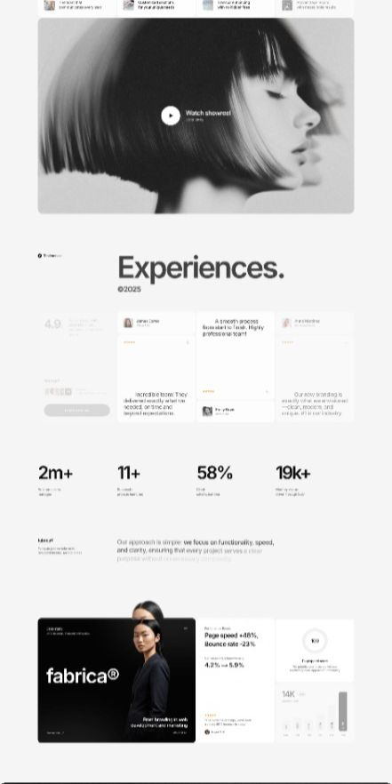

# Experiences — High Definition Portfolio Template

A high-definition, editorial-grade portfolio and agency showcase template designed for creative studios, designers, full-stack engineers, and digital craftspeople. Built around minimalist typography, high-impact imagery, dynamic case study showcases, and data-driven proof points.

---

## 🌟 Visual Preview & Layout Overview



---

## ✨ Key Features & Architectural Modules

### 1. 🎬 Cinematic Hero & Showreel
* **Curved Editorial Media Container**: Clean rounded-corner frame housing high-definition visual imagery with video showreel modal trigger.
* **Interactive Media Overlay**: Play state indicator with backdrop blur and smooth hover expansion.
* **Top Navigation Ticker**: Multi-column contextual snippet bar for fast navigation and feature highlights.

### 2. 🔤 Editorial Typography & Identity Header
* **Bold Serif / Sans Contrast**: Distinctive `"Experiences."` branding accompanied by copyright/year metadata badge.
* **Structured Hierarchy**: Balanced negative space directing attention toward critical content pillars.

### 3. ⭐ Floating Social Proof & Testimonial Carousel
* **Rating Badges & Star Accents**: 4.9/5 composite score display with verified review counts.
* **Micro-Card Quotes**: Modular cards presenting authentic client praise, avatar avatars, roles, and company affiliations.
* **Card Depth**: Soft shadows, subtle borders, and micro-elevation transitions on hover.

### 4. 📊 High-Impact Stat Metrics
* **Data Indicators**: Key performance indicators such as `2m+`, `11+`, `58%`, and `19k+`.
* **Descriptive Subtext**: Contextual labels emphasizing reach, speed improvements, and deliverable scale.

### 5. 💡 Philosophy & Mission Statement
* **Highlight Typography**: Distinct visual weights separating core philosophy from narrative explanations (*"we focus on functionality, speed, and clarity..."*).

### 6. 💼 Case Study & Project Showcase Grid
* **Featured Showcase (e.g. fabrica®)**: High-contrast dark card presentation showcasing identity, branding, web development, and digital marketing.
* **Performance Impact Badges**: Real-world metrics highlights (e.g., *Page speed +46%*, *Bounce rate -23%*, *Conversion rate 4.2% -> 5.9%*).
* **Analytics Widget & Score Circle**: Embedded visual data cards, bar graphs (`14K+`), and optimization indicators.

---

## 🎨 Design System & Styling Tokens

| Element | Specification |
| :--- | :--- |
| **Primary Typography** | Syne / Plus Jakarta Sans / Inter / Editorial Serif |
| **Color Palette** | Monochromatic (Deep Charcoal `#0D0D0D`, Pure Black `#000000`, Off-White `#FAFAFA`, Crisp White `#FFFFFF`) |
| **Accent Colors** | Subtle Amber / Gold (`#F59E0B`) for ratings, Muted Slate (`#64748B`) for secondary metadata |
| **Border Radius** | `16px` to `24px` for outer frames; `8px` to `12px` for badges and cards |
| **Shadows & Elevation** | Multi-layered diffuse ambient shadows (`0 10px 30px rgba(0,0,0,0.04)`) |

---

## 🚀 Recommended Tech Stack

You can implement this template using any of the following modern stacks:

* **HTML5 + Vanilla CSS / SCSS + JavaScript** (Zero-dependency, maximum performance)
* **React / Next.js + Tailwind CSS + Framer Motion** (For interactive scroll triggers and component reusability)
* **Astro + CSS Modules** (For ultra-fast, content-focused static generation)
* **Vue 3 / Nuxt + GSAP** (For smooth timeline animations and page transitions)

---

## 📂 Project Structure

```text
experiences-portfolio-high-definition-template/
├── .gitignore               # Ignored dependencies, build outputs, and caches
├── README.md                # Comprehensive documentation and design specification
└── 65372632086875744.jpg    # High-definition template reference mockup
```

---

## 🛠️ Getting Started & Setup

### Prerequisites
- Node.js `>= 18.x` (if extending into a Node/Vite/Next.js environment)
- Git installed on your local machine

### Clone the Repository
```bash
git clone https://github.com/girishlade111/experiences-portfolio-high-definition-template.git
cd experiences-portfolio-high-definition-template
```

---

## 📄 License & Attribution

Designed and curated by **Girish Lade** ([@girishlade111](https://github.com/girishlade111)).  
Open-source under the [MIT License](LICENSE).
